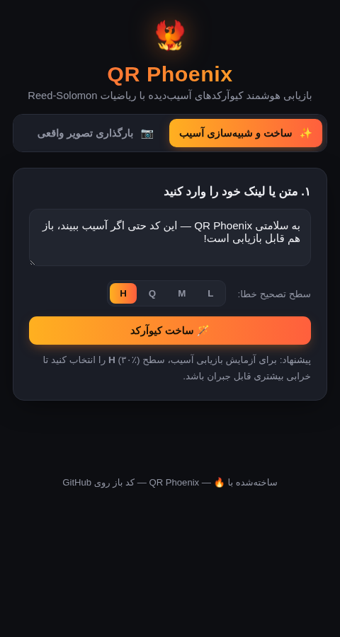
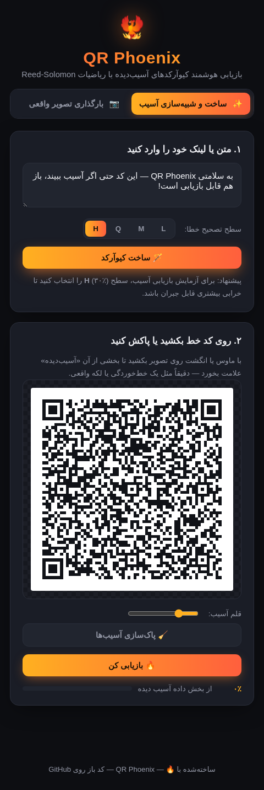
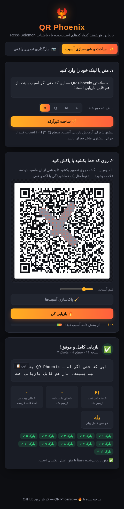
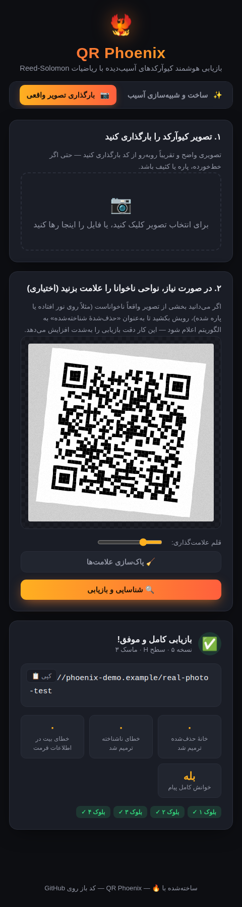

# 🐦‍🔥 QR Phoenix

**بازیابی هوشمند کیوآرکدهای خط‌خورده، پاره یا پاک‌شده — با ریاضیات Reed-Solomon، نه حدس و گمان.**

[](https://github.com/OWNER/qr-phoenix/actions/workflows/test.yml)


> پس از پوش کردن روی گیت‌هاب، `OWNER` را در بج بالا با نام‌کاربری/سازمان خودتان جایگزین کنید تا نشان
> وضعیت تست‌ها (CI) درست نمایش داده شود.

## فهرست

- [این چیست؟](#این-چیست)
- [تصاویر (اجراشده در مرورگر واقعی)](#تصاویر-اجراشده-در-مرورگر-واقعی)
- [چرا واقعاً «آسیب‌دیده» را بازیابی می‌کند؟](#چرا-واقعاً-آسیب‌دیده-را-بازیابی-می‌کند)
- [ساختار پروژه](#ساختار-پروژه)
- [جریان داده (Architecture)](#جریان-داده-architecture)
- [مرجع API هر ماژول](#مرجع-api-هر-ماژول)
- [اجرا](#اجرا)
- [اجرای آزمایش‌ها + CI](#اجرای-آزمایش‌ها--ci)
- [محدودیت‌های شناخته‌شده](#محدودیت‌های-شناخته‌شده)
- [کتابخانه‌هایی که می‌شد به‌جای بازنویسی از صفر استفاده کرد](#کتابخانه‌هایی-که-می‌شد-به‌جای-بازنویسی-از-صفر-استفاده-کرد)
- [نقشهٔ راه](#نقشهٔ-راه)
- [مشارکت](#مشارکت)
- [مجوز](#مجوز)

## این چیست؟

QR Phoenix یک اپلیکیشن تحت وب و کاملاً *client-side* است (بدون سرور، بدون هیچ کتابخانهٔ
بیرونی برای موتور کیوآرکد) که:

- کیوآرکد را از **صفر** رمزگذاری و رمزگشایی می‌کند — تمام ریاضیات (GF(256)، Reed-Solomon،
  BCH، ماسک‌گذاری) در `/core` با جاوااسکریپت خالص پیاده‌سازی شده است.
- اجازه می‌دهد کیوآرکد را **خط بزنید یا پاک کنید** (شبیه‌سازی آسیب واقعی) و سپس آن را
  **بازیابی** کنید.
- می‌تواند **عکس واقعی** یک کیوآرکد آسیب‌دیده را بگیرد، الگوهای گوشه را پیدا کند،
  زاویهٔ دوربین را تصحیح کند و محتوایش را استخراج کند — حتی اگر بخشی از آن ناخوانا باشد.

## تصاویر (اجراشده در مرورگر واقعی)

همهٔ تصاویر زیر با Playwright روی Chromium واقعی گرفته شده‌اند، نه موکاپ.

| صفحهٔ اصلی | ساخت کیوآرکد | خط‌خوردگی با قلم |
|---|---|---|
|  |  |  |

| بازیابی کامل (تب شبیه‌سازی) | بازیابی از عکس واقعی چرخیده/نویزی |
|---|---|
|  |  |

## چرا واقعاً «آسیب‌دیده» را بازیابی می‌کند؟

هر کیوآرکد از ابتدا با کدهای **Reed-Solomon** روی میدان متناهی GF(256) محافظت می‌شود.
این کدها می‌توانند تعدادی «بایت خراب» را تصحیح کنند — اما نکتهٔ کلیدی این‌جاست:

> اگر **محل** آسیب را از قبل بدانیم (آن را **Erasure** بنامیم)، الگوریتم می‌تواند
> تقریباً **دو برابر** بیشتر از حالتی که فقط با «یک خطای ناشناخته» روبه‌رو باشد، تصحیح کند.

به همین دلیل، قلم «آسیب‌رسانی» در این ابزار صرفاً یک جلوهٔ گرافیکی نیست: مختصات دقیق هر
ماژول آسیب‌دیده مستقیماً به‌عنوان erasure به موتور Reed-Solomon اعلام می‌شود.
آزمایش‌های خودکار پروژه (پوشهٔ `test/`) این را عملاً نشان می‌دهند: با سطح تصحیح خطای
`H`، حتی وقتی حدود ۳۵٪ از ناحیهٔ داده به‌صورت یک لکهٔ پیوسته آسیب دیده باشد، اگر محل آن
علامت‌گذاری شده باشد، بازیابی همچنان موفق است.

## ساختار پروژه

```
qr-phoenix/
├── core/                  # موتور کیوآرکد — خالص جاوااسکریپت، بدون وابستگی، قابل استفاده در مرورگر و Node
│   ├── 01-gf256.js        # حساب روی میدان متناهی GF(256)
│   ├── 02-reedsolomon.js  # رمزگذاری/رمزگشایی Reed-Solomon با پشتیبانی از Erasure
│   ├── 03-tables.js       # جداول ساختاری استاندارد ISO/IEC 18004 (نسخه‌های ۱ تا ۲۰)
│   ├── 04-bch.js          # خوداصلاحیِ اطلاعات فرمت/نسخه (BCH)
│   ├── 05-matrix.js       # هندسهٔ ماتریس: الگوهای راهنما، مسیر زیگزاگ داده، ماسک‌ها
│   ├── 06-encoder.js      # متن -> ماتریس کامل کیوآرکد
│   ├── 07-decoder.js      # ماتریس (با خانه‌های حذف‌شده) -> متن بازیابی‌شده
│   └── 08-imaging.js      # پردازش تصویر: باینری‌سازی، تشخیص الگوی راهنما، هوموگرافی، نمونه‌برداری
├── web/                   # رابط کاربری (HTML/CSS/JS خالص، فونت وزیرمتن، راست‌به‌چپ)
│   ├── index.html
│   ├── style.css
│   └── app.js
├── test/                  # آزمایش‌های خودکار (Node)
├── docs/screenshots/      # تصاویر واقعی از اجرای برنامه
├── .github/workflows/     # CI — اجرای خودکار تست‌ها روی هر push
└── package.json
```

هیچ مرحلهٔ build ای در کار نیست — `web/index.html` مستقیماً فایل‌های `core/*.js` را با
تگ `<script>` بارگذاری می‌کند و همه چیز روی `window.QR` قرار می‌گیرد.

## جریان داده (Architecture)

**مسیر تولید (Encode):**
```
متن ورودی
   │
   ▼
06-encoder.js  ── انتخاب حالت (عددی/الفبا‌عددی/بایت) + کوچک‌ترین نسخهٔ کافی
   │
   ▼
02-reedsolomon.js (encode) ── افزودن کدواژه‌های تصحیح خطا به هر بلوک
   │
   ▼
05-matrix.js ── چیدمان زیگزاگ داده‌ها در ماتریس + انتخاب بهترین ماسک (کمترین جریمه)
   │
   ▼
04-bch.js ── نوشتن اطلاعات فرمت/نسخهٔ خوداصلاح‌شونده
   │
   ▼
ماتریس نهایی کیوآرکد (۰/۱)
```

**مسیر بازیابی (Decode) — از تصویر واقعی:**
```
تصویر (پیکسل خام RGBA)
   │
   ▼
08-imaging.js ── خاکستری‌سازی → آستانهٔ Otsu → باینری‌سازی
   │
   ▼
08-imaging.js ── یافتن ۳ الگوی راهنما (نسبت ۱:۱:۳:۱:۱) → طبقه‌بندی TL/TR/BL
   │
   ▼
08-imaging.js ── تخمین نسخه + محاسبهٔ هوموگرافی (تصحیح زاویهٔ دوربین)
   │
   ▼
08-imaging.js ── نمونه‌برداری هر ماژول (+ ترکیب با نواحی علامت‌گذاری‌شدهٔ دستی = Erasure)
   │
   ▼
07-decoder.js ── خواندن اطلاعات فرمت/نسخه (04-bch.js) → حذف ماسک → استخراج کدواژه‌ها
   │
   ▼
02-reedsolomon.js (decode) ── تصحیح هر بلوک با در نظر گرفتن Erasureها
   │
   ▼
07-decoder.js ── تفسیر جریان بیت (حالت‌ها) → متن نهایی + آمار بازیابی
```

مسیر «ساخت و شبیه‌سازی آسیب» همین زنجیرهٔ پایینی را طی می‌کند، با این تفاوت که به‌جای
`08-imaging.js`، مستقیماً از ماتریس شناخته‌شدهٔ تولیدشده استفاده می‌شود (نیازی به تشخیص
تصویر نیست، چون هندسهٔ آن از قبل معلوم است).

## مرجع API هر ماژول

همهٔ ماژول‌ها روی `window.QR` (یا `global.QR` در Node) قرار می‌گیرند.

### `QR.gf256`
حساب روی میدان متناهی GF(256) با چندجمله‌ای اولیهٔ `0x11D` (طبق استاندارد).
- `mul(a, b)`, `div(a, b)`, `inv(a)`, `pow(a, n)` — عملگرهای پایه
- `polyMul(p, q)`, `polyEval(p, x)` — عملیات روی چندجمله‌ای (آرایه، درجهٔ بالا اول)

### `QR.rs`
موتور Reed-Solomon.
- `generatorPoly(degree)` → چندجمله‌ای مولد مونیک
- `encode(data: number[], ecCount: number)` → آرایهٔ کدواژه‌های EC
- `decode(received: number[], ecCount: number, erasures: number[])` →
  `{ ok, codewords, errorsCorrected, erasuresCorrected, reason? }`
  — `erasures` آرایه‌ای از اندیس‌های (۰-پایه) *شناخته‌شده* به‌عنوان ناخوانا است.

### `QR.tables`
جداول ثابت استاندارد: `EC` (سطوح L/M/Q/H)، `blockInfo(version, ecLevel)`،
`alignmentPositions(version)`، `charCountBits(mode, version)`، جدول کاراکترهای الفبا‌عددی.

### `QR.bch`
- `encodeFormat(ecLevelBits, maskPattern)` / `decodeFormat(bits)`
- `encodeVersion(version)` / `decodeVersion(bits)` (نسخه ≥۷)
  — رمزگشایی با نزدیک‌ترین فاصلهٔ همینگ به یکی از کدواژه‌های معتبر (تصحیح تا ۳ بیت خطا).

### `QR.matrix`
- `buildSkeleton(version)` → `{ matrix, reserved, size }` (الگوهای راهنما/زمان‌بندی/تراز رسم‌شده)
- `dataPath(size, reserved)` → آرایهٔ `[row, col]` به ترتیب زیگزاگ استاندارد
- `MASKS[0..7]`, `penaltyScore(matrix)` → ۴ قانون جریمهٔ استاندارد برای انتخاب ماسک

### `QR.encoder`
- `encode(text, ecLevel, forceVersion?)` → `{ matrix, version, ecLevel, mask, size, mode }`

### `QR.decoder`
- `decode(matrix: (0|1|null)[][])` →
  `{ ok, fullyRecovered, version, ecLevel, mask, erasuresCorrected, errorsCorrected,
     blockReports, text, segments, fullyParsed }`
  — هر خانهٔ `null` در ماتریس ورودی یعنی «محل شناخته‌شدهٔ ناخوانا» (erasure واقعی).

### `QR.imaging`
- `detectAndSample(imageData, { isForcedErased? })` →
  `{ ok, matrix, confidence, version, size, finders, homography }` یا `{ ok:false, reason }`
- توابع کمکی مستقل: `toGrayscale`, `otsuThreshold`, `binarize`, `findFinderCandidates`,
  `classifyFinders`, `computeHomography`, `applyHomography`, `estimateVersion`

## اجرا

```bash
git clone https://github.com/<username>/qr-phoenix.git
cd qr-phoenix
# هر سرور استاتیک ساده‌ای کار می‌کند، مثلاً:
npx serve .
# یا:
python3 -m http.server 8080
```

سپس مرورگر را باز کنید روی آدرس سرور + `/web/` (مثلاً `http://localhost:8080/web/`).

می‌توانید مستقیم روی **GitHub Pages** هم دیپلویش کنید: از تنظیمات ریپو (Settings → Pages)
شاخهٔ `main` و پوشهٔ ریشه (`/`) را فعال کنید. فایل `index.html` در ریشهٔ پروژه خودش به
`web/index.html` ریدایرکت می‌کند، پس آدرس نهایی مستقیماً `https://<username>.github.io/qr-phoenix/`
کار خواهد کرد.

## اجرای آزمایش‌ها + CI

```bash
npm install   # فقط برای وابستگی توسعهٔ اختیاری «canvas» (تست پردازش تصویر)
npm test
```

یک workflow آماده در `.github/workflows/test.yml` قرار دارد که با هر `push` یا Pull Request
به‌طور خودکار در GitHub Actions اجرا می‌شود — نیازی به تنظیم اضافه نیست، فقط پروژه را پوش کنید.

آزمایش‌ها شامل:
1. **۱۰۵۰ آزمایش تصادفی** روی موتور Reed-Solomon (داده‌های تصادفی + آسیب تصادفی در محدودهٔ ظرفیت نظری).
2. صحت کدهای BCH فرمت/نسخه، از جمله تطبیق با مقادیر مرجع استاندارد ISO/IEC 18004.
3. رمزگذاری/رمزگشایی end-to-end برای متن لاتین، اعداد، URL، و متن فارسی (UTF-8)، هم در حالت
   سالم و هم در حالت آسیب‌دیده (لکهٔ پیوسته تا ~۳۵٪ با سطح H).
4. پردازش تصویر روی کیوآرکدهای شبیه‌سازی‌شدهٔ «عکس‌گرفته‌شده» (چرخش، نویز، مقیاس) با
   استفاده از `node-canvas`.

علاوه بر این، کل برنامه یک‌بار به‌صورت دستی با **Playwright روی Chromium واقعی** اجرا و
با ماوس/درگ‌وdrop تست شده (نتیجه در `docs/screenshots/`) تا از سالم بودن رابط کاربری هم
اطمینان حاصل شود.

## محدودیت‌های شناخته‌شده

- نسخه‌های ۱ تا ۲۰ کیوآرکد پشتیبانی می‌شوند (۲۱×۲۱ تا ۹۷×۹۷ ماژول) — برای اکثر کاربردها
  (لینک، متن، Wi-Fi، vCard) بیش از کافی است. افزودن نسخه‌های ۲۱ تا ۴۰ فقط نیاز به تکمیل
  جدول‌های `core/03-tables.js` دارد (ساختار کد از قبل عمومی نوشته شده).
- حالت‌های Kanji و ECI رمزگشایی نمی‌شوند؛ اگر با آن‌ها مواجه شود، رمزگشایی به‌طور شفاف
  متوقف می‌شود (به‌جای حدس زدن).
- تشخیص الگوی راهنما در تب «بارگذاری تصویر» برای عکس‌های نسبتاً روبه‌رو و با نور معقول
  بهترین عملکرد را دارد؛ چرخش‌های شدید یا کیوآرکدهای بسیار کوچک در قاب ممکن است نیاز به
  علامت‌گذاری دستی نواحی مبهم داشته باشند (که خودِ ابزار برایش قلم دارد).
- تشخیص تصویر فعلاً آستانهٔ Otsu سراسری (Global) استفاده می‌کند، نه محلی (Adaptive)؛ نور
  خیلی نامتوازن در عکس ممکن است دقت را کم کند (در «نقشهٔ راه» پایین‌تر آمده).

## کتابخانه‌هایی که می‌شد به‌جای بازنویسی از صفر استفاده کرد

انتخاب این پروژه این بود که **همهٔ ریاضیات از صفر نوشته شود** (چون هدف اصلی، بازیابی
واقعی از طریق Erasure decoding بود که در کتابخانه‌های معمولی کیوآرکد اصلاً وجود ندارد و
باید به موتور Reed-Solomon دسترسی مستقیم داشت). اما اگر بخواهید پروژه را گسترش دهید یا
نسخهٔ ساده‌تری بسازید، این‌ها گزینه‌های واقعی هستند:

| نیاز | کتابخانه | چرا اینجا استفاده نشد |
|---|---|---|
| رمزگشایی استاندارد (بدون Erasure) | [`jsQR`](https://github.com/cozmo/jsQR) | سریع و قابل‌اعتماد است، اما فقط رمزگشایی معمولی می‌دهد؛ به کدواژه‌ها و مکان دقیق خطا دسترسی نمی‌دهد. |
| رمزگشایی استاندارد (پرکاربردتر، چندسکویی) | [`zxing-js/library`](https://github.com/zxing-js/library) | همان محدودیت `jsQR` — یک جعبهٔ سیاه. |
| تولید کیوآرکد | [`qrcode`](https://www.npmjs.com/package/qrcode) یا [`qrcode-generator`](https://www.npmjs.com/package/qrcode-generator) | برای تب «تولید»، این‌ها کافی بودند؛ فقط برای تب «شبیه‌سازی آسیب» باید مسیر بازیابی هم داشته باشیم که این کتابخانه‌ها ندارند. |
| کدهای Reed-Solomon عمومی (نه فقط کیوآرکد) | [`reed-solomon`](https://www.npmjs.com/package/reed-solomon) یا پورت‌های `ts-reed-solomon` | اغلب فقط تصحیح خطا دارند، نه Erasure؛ و برای فرمت خاص کیوآرکد (چیدمان بلوک‌ها) تطبیق لازم دارد. |
| پردازش تصویر/هوموگرافی قوی‌تر | [`OpenCV.js`](https://docs.opencv.org/4.x/d5/d10/tutorial_js_root.html) | خیلی دقیق‌تر از پیاده‌سازی دستی فعلی است (تشخیص لبه، threshold تطبیقی، homography آماده)، اما حجم بستهٔ آن (چند مگابایت WASM) با هدف «بدون وابستگی» این پروژه در تضاد بود. |
| پردازش تصویر سبک‌تر در Node (برای تست/CLI) | [`sharp`](https://www.npmjs.com/package/sharp) یا [`jimp`](https://www.npmjs.com/package/jimp) | فعلاً `node-canvas` برای تولید تصاویر آزمایشی کافی بود. |

اگر هدف صرفاً «یک اسکنر معمولی» بود، ترکیب `jsQR` + `qrcode` در چند ساعت جواب می‌داد.
ارزش افزودهٔ این پروژه دقیقاً در بخش‌هایی است که کتابخانه‌های آماده پوشش نمی‌دهند: دسترسی
مستقیم به Erasure decoding و امکان علامت‌گذاری دستی نواحی آسیب‌دیده.

## نقشهٔ راه

- [ ] پشتیبانی از نسخه‌های ۲۱ تا ۴۰ (فقط تکمیل جدول).
- [ ] آستانه‌گذاری تطبیقی/محلی به‌جای Otsu سراسری برای عکس‌های با نور نامتوازن.
- [ ] پشتیبانی از حالت Kanji و ECI.
- [ ] رابط دوربین زنده (getUserMedia) به‌جای فقط بارگذاری فایل.
- [ ] پورت به پایتون برای نسخهٔ دسکتاپ ویندوز (در حال بررسی).

## مشارکت

Pull Requestها خوش‌آمدند. قبل از ارسال:
1. `npm test` را اجرا کنید و مطمئن شوید همه سبز است.
2. اگر منطق جدیدی به `core/` اضافه می‌کنید، یک تست متناظر در `test/` هم اضافه کنید —
   به‌خصوص برای هر چیزی که به مسیر Reed-Solomon/BCH نزدیک است، چون باگ‌های ظریف آنجا
   ساکت هستند (نتیجهٔ غلط می‌دهند، نه خطا).
3. سبک کد فعلی: ES5-style (بدون `class`/`arrow function` در `core/`) تا سازگاری حداکثری
   با مرورگرهای قدیمی‌تر حفظ شود؛ در `web/app.js` هم همین سبک رعایت شده.

## مجوز

MIT — در فایل [LICENSE](./LICENSE).
